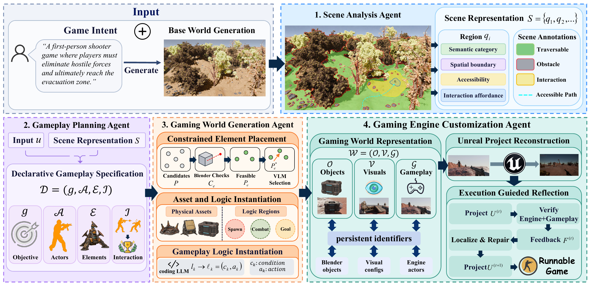

# Code2Games: Enabling Coding Agents for Gaming World Generation

This is the official repository for the paper:
> **Code2Games: Enabling Coding Agents for Gaming World Generation**
>
> [Wei Wu](https://github.com/weiwu-7)<sup>1*</sup>, [Ziyang Xu](https://github.com/xzy-Zayn)<sup>1*</sup>, [Zeyu Zhang](https://steve-zeyu-zhang.github.io/)<sup>1*†</sup>, [Yang Zhao](https://yangyangkiki.github.io/)<sup>2</sup>, and [Hao Tang](https://ha0tang.github.io/)<sup>1‡</sup>
>
> <sup>1</sup>School of Computer Science, Peking University  
> <sup>2</sup>La Trobe University
>
> \*Equal contribution. <sup>†</sup>Project lead. <sup>‡</sup>Corresponding author.
>
> ### [Paper](https://arxiv.org/abs/2600.00000) | [Website](https://aigeeksgroup.github.io/Code2Games)| [GameCode4D](https://huggingface.co/datasets/AIGeeksGroup/GameCode4D)

https://github.com/user-attachments/assets/d9be6a46-b422-4737-97f0-e9eda0694fb6

## Overview

Code2Games transforms a natural-language game intent and a Code2Worlds scene into a complete gaming world and gameplay video through a unified agent pipeline.



## Repository Structure

```text
Code2Games/
├── shared_representation/          # Shared paths, I/O, and placement constraints
├── scene_and_gameplay_planning/    # Scene analysis and declarative gameplay planning
├── game_realization/
│   ├── element_placement/          # Candidate extraction and semantic selection
│   └── asset_instantiation/        # Asset generation, NPC placement, and Blender staging
├── gameplay_logic/                 # Gameplay path, motion, follow camera, and rendering
├── scripts/
│   └── generate_gaming_world.sh    # Complete gaming-world pipeline
└── requirements.txt
```

## Quick Start

### 1. Environment Setup

Clone the repository and create a Python environment:

```bash
git clone https://github.com/AIGeeksGroup/Code2Games.git
cd Code2Games
conda create -n code2games python=3.11
conda activate code2games
pip install -r requirements.txt
```

Install the following external components separately:

- [Blender 4.2](https://www.blender.org/download/)
- [Hunyuan3D 2.1](https://github.com/Tencent-Hunyuan/Hunyuan3D-2.1), either as a local installation or a Gradio service
- A Code2Worlds-generated `.blend` scene with an active camera

Blender provides `bpy` and `mathutils`; do not install them with `pip`.

### 2. Configure Models and Services

The current asset-generation stage uses DashScope for reference-image generation. Configure credentials through environment variables and never place API keys in source files:

```bash
export DASHSCOPE_API_KEY="your_api_key"
export DASHSCOPE_BASE_URL="https://dashscope.aliyuncs.com/compatible-mode/v1"
export CODE2GAMES_VLM_MODEL="qwen3-vl-plus"

# Optional executable overrides
export PYTHON_BIN="python"
export BLENDER_BIN="blender"

# Hunyuan3D: gradio (default) or local
export HUNYUAN_BACKEND="gradio"
export HUNYUAN_SERVER="http://127.0.0.1:8080"
```

For a local Hunyuan3D installation:

```bash
export HUNYUAN_BACKEND="local"
export HUNYUAN3D_REPO="/path/to/Hunyuan3D-2.1"
export HUNYUAN3D_MODEL_PATH="tencent/Hunyuan3D-2.1"
```

### 3. Obtain an NPC

The NPC is part of the generated gaming world, so the current end-to-end script requires an animated humanoid FBX before world realization.

Recommended sources:

- [Mixamo](https://www.mixamo.com/): choose a humanoid character, apply a walk/run animation, enable **In Place** when available, and download an animated FBX **With Skin**.
- [CGTrader character models](https://www.cgtrader.com/free-3d-models/character): filter for an FBX, rigged, game-ready humanoid. Check the license for every model. If the character is not animated, upload it to Mixamo for auto-rigging and animation.

For a custom CGTrader model, a typical preparation flow is:

```text
CGTrader humanoid model
    -> clean neutral/T-pose
    -> upload FBX/OBJ/ZIP to Mixamo
    -> auto-rig
    -> apply walk or run animation
    -> enable In Place
    -> download FBX With Skin
```

The current Blender executor is designed for an animated humanoid FBX. Mixamo auto-rigging supports bipedal humanoids; non-humanoid creatures require a separately prepared rig and compatible animation.

Place the downloaded file at the conventional path:

```text
assets/mixamo/mixamo_run.fbx
```

You may also keep it anywhere and pass its path directly to the script.

### 4. Generate the Gaming World

Run the complete Blender-world realization stage:

```bash
bash scripts/generate_gaming_world.sh \
  "/path/to/code2worlds/scene.blend" \
  "Create a third-person monster hunt in a dark forest. Track the creature, defeat it, and claim the trophy." \
  "assets/mixamo/mixamo_run.fbx" \
  "monster_hunt"
```

Arguments are:

```text
generate_gaming_world.sh <scene.blend> <game-intent prompt> <animated-npc.fbx> [game-name]
```

The optional game name isolates outputs from different games. The final outputs are:

```text
output/game_staging/monster_hunt/gameplay_output/gaming_world.blend
output/game_staging/monster_hunt/gameplay_output/gameplay.mp4
```

If no game name is provided, outputs are written directly under `output/game_staging/`.

All game assets are represented in GLB format.

Existing generated GLBs can be reused:

```bash
export CODE2GAMES_SKIP_EXISTING_ASSETS=1
```

## Output Layout

```text
output/game_staging/<game-name>/
├── default_camera_packet/          # Scene analysis, rules, candidates, and placement plan
├── asset_realization/              # Asset plan and LLM response
├── asset_generation/               # Reference images, logs, and generation manifest
├── asset_placement/                # Placement reports and validation previews
├── npc_staging/                    # NPC placement report
├── staged_scene.blend              # Pipeline scene after asset and NPC staging
├── gameplay_path/                  # Physics-aware gameplay path
└── gameplay_output/                # Final gaming_world.blend and gameplay.mp4
```

Generated GLBs are stored under:

```text
assets/generated_glb/<game-name>/
```

## Acknowledgement

We thank the authors of [Code2Worlds](https://github.com/AIGeeksGroup/Code2Worlds), [Infinigen](https://github.com/princeton-vl/infinigen), [Hunyuan3D](https://github.com/Tencent-Hunyuan/Hunyuan3D-2.1), Blender, Adobe Mixamo, and the creators of the 3D assets used by this project.


